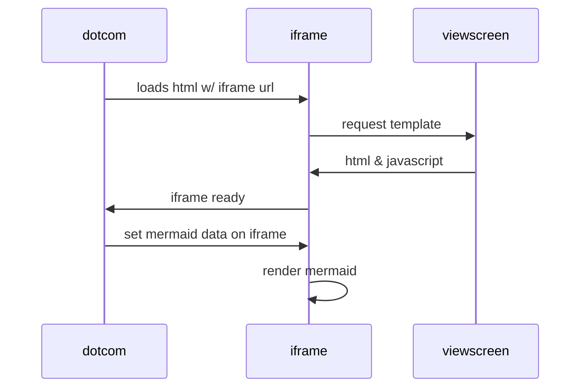

PrintF:

Printf function is an output function that prints characters to stdout / console / command shell. Printf function returns the number of characters printed to the output file stream(stdout / console / shell).

Printf takes a formatting string and a number of optional arguments. Printf converts these arguments (char, string, int, long, float, double etc) to printable strings and the final constructed string is transferred to the stdout file stream.

The symbol “%” denotes the beginning of a format mark. The mark “%d” is replaced by the value of variable counter and the resulting string is printed. The symbol “\n” represents a new line.

